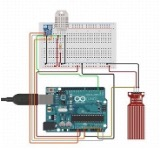
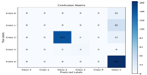
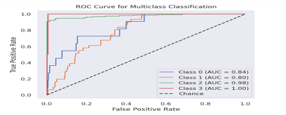

# Smart Weather AI: Climate Resilience and Prediction System

**Smart Weather AI** is an integrated environmental monitoring solution. Unlike standard weather stations, this system performs **Edge AI**—running a mathematical implementation of a **Gaussian Naïve Bayes** classifier directly on an Arduino UNO after refining sensor data through a **Kalman Filter**.

---

## 📸 Hardware Demonstration

The system acts as a localized "Smart Node" that processes data internally rather than just sending raw values to a PC.

### 1. Prototype & Circuitry

The hardware integrates a DHT11 (Temp/Humidity) and BMP-280 (Pressure) sensor hub.

| Circuit Simulation |
| --- |
|  |
| *Figure 1: Prototype circuits simulation for connection demonstration.* |

---

## 🧠 Software & Algorithm Architecture

### 1. Signal Processing (Kalman Filter)

To ensure the AI receives clean data, a **Kalman Filter** is applied in the C++ code to remove electronic noise from the sensors.

| Sensor | Raw RMSE | Filtered RMSE | Improvement |
| --- | --- | --- | --- |
| **Pressure (BMP-280)** | 1.3660 | **0.2430** | ~82% reduction |
| **Temperature (DHT11)** | 3.6708 | **1.8721** | ~49% reduction |

### 2. Edge AI: Gaussian Naïve Bayes in C++

The unique aspect of this project is the **Mathematical Integration**:

1. **Offline Training**: The model was trained in Python (Scikit-Learn) using historical datasets to calculate the **Mean** and **Standard Deviation** for each weather class (Drizzle, Foggy, Sunny, Rainy).
2. **C++ Implementation**: These trained parameters were hardcoded into the `.ino` file. The Arduino calculates the Gaussian probability density function mathematically to predict weather states in real-time without needing a permanent PC connection.

---

## 📊 Performance & Results

The system achieved an accuracy of **84.15%**. The high AUC scores indicate that the mathematical implementation on the microcontroller effectively matches the performance of the Python-based training environment.

| Confusion Matrix | AUC Curve |
| --- | --- |
|  |  |
| *Figure 5: Confusion matrix showing prediction accuracy.* | *Figure 6: AUC curve for the four predicted weather classes.* |

---

## 🚀 Getting Started

### 🔌 Hardware Setup

1. Connect the **DHT11** and **BMP-280** to the Arduino UNO as shown in Figure 1.
2. Connect the **Water Detection Module** to the Analog pins.

### 💻 Running the System

This repository is standalone for the Arduino environment. You do not need Python to run the live prediction:

1. Open `main.ino` in the **Arduino IDE**.
2. Ensure you have the required libraries installed: `Adafruit_BMP280` and `DHT`.
3. Upload the code to your Arduino.
4. Open the **Serial Monitor** (9600 baud) to see the filtered sensor data and the real-time AI weather prediction.

---

## ✉️ Contact

**Mohamed Ashraf** - [saudy754@gmail.com] - Ain Shams University, Egypt.
